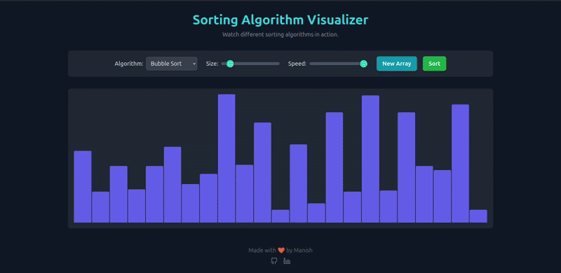

# Sorting Algorithm Visualizer

A responsive and interactive web-based tool designed to help you visualize the inner workings of classic sorting algorithms. Watch in real-time as arrays are sorted, with controls for algorithm selection, array size, and animation speed.



---

## ✨ Features

* **Interactive Visualization:** Watch the sorting process step-by-step with color-coded bars representing comparisons, swaps, and sorted elements.
* **Multiple Algorithms:** Choose from a selection of fundamental sorting algorithms:
    * Bubble Sort
    * Selection Sort
    * Insertion Sort
    * Merge Sort
    * Quick Sort
* **Customizable Controls:**
    * **Algorithm Selection:** Switch between different sorting methods instantly.
    * **Array Size:** Adjust the number of elements in the array (from 10 to 150).
    * **Animation Speed:** Slow down the animation to carefully observe each step or speed it up for a quick overview.
* **Dynamic Array Generation:** Create a new random array at any time with a single click.
* **Fully Responsive:** The layout is designed to work seamlessly on desktops, tablets, and mobile devices.

---

## 🛠️ Technologies Used

This project was built using only front-end technologies, making it lightweight and easy to run anywhere.

* **HTML5:** For the core structure and content.
* **CSS3:** For custom styling and animations.
* **Tailwind CSS:** For a modern, utility-first styling workflow.
* **JavaScript (ES6+):** For all the logic, including algorithm implementation and DOM manipulation.

---

## 🚀 How to Run Locally

No complex setup is required! Since this is a pure front-end project, you can run it by following these simple steps:

1.  **Clone the repository:**
    ```bash
    git clone https://github.com/manish-potdar/Sorting-Visualizer.git
    ```

2.  **Navigate to the project directory:**
    ```bash
    cd sorting-visualizer
    ```

3.  **Open the `index.html` file:**
    Simply open the `index.html` file in your favorite web browser. That's it!

---

## 🔧 Customization

Want to make the visualization even slower or faster? You can easily adjust the animation speed range by modifying the `sleep` function in **`script.js`**:

```javascript
function sleep(ms) {
    const delay = 151 - speedSlider.value;
    // To make it slower, decrease the divisor (e.g., / 5)
    // To make it faster, increase the divisor (e.g., / 20)
    return new Promise(resolve => setTimeout(resolve, ms * (delay / 10)));
}

